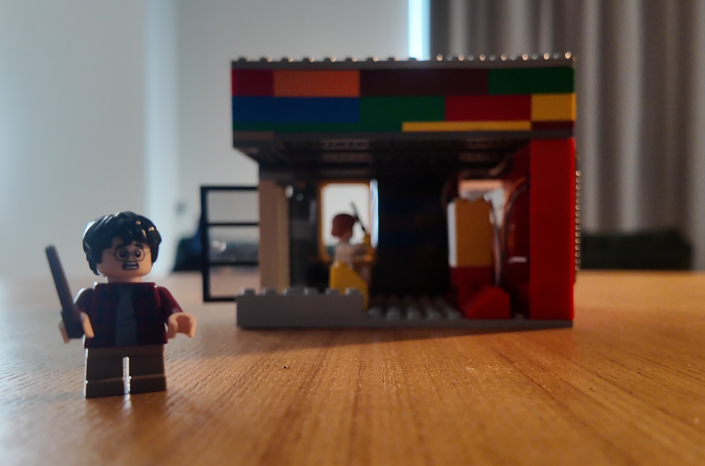
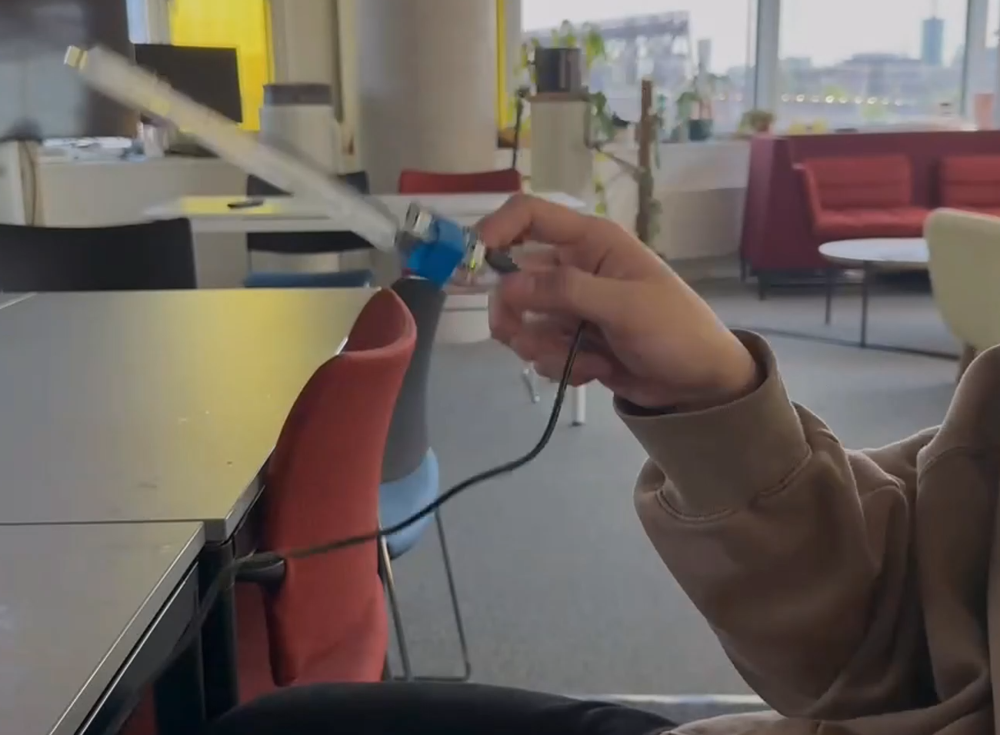
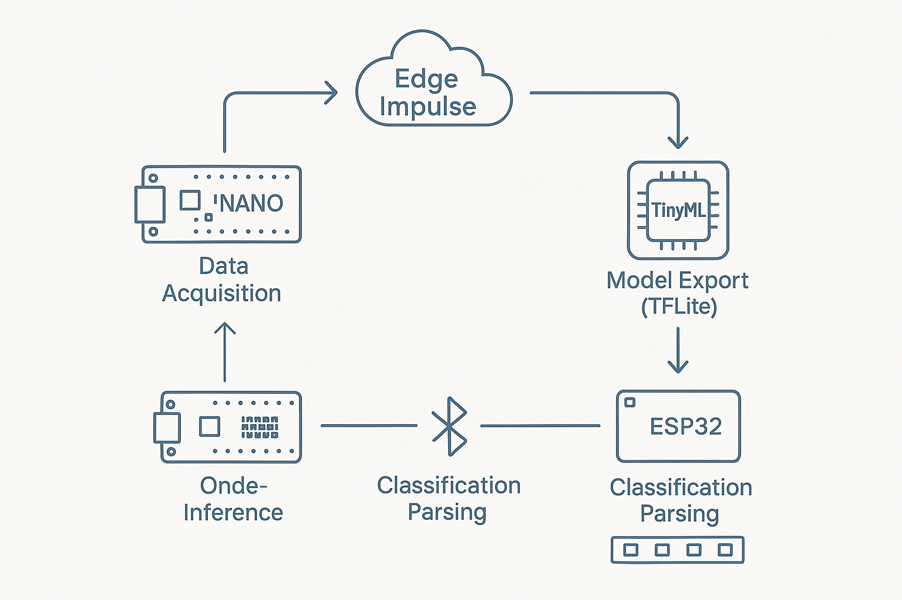
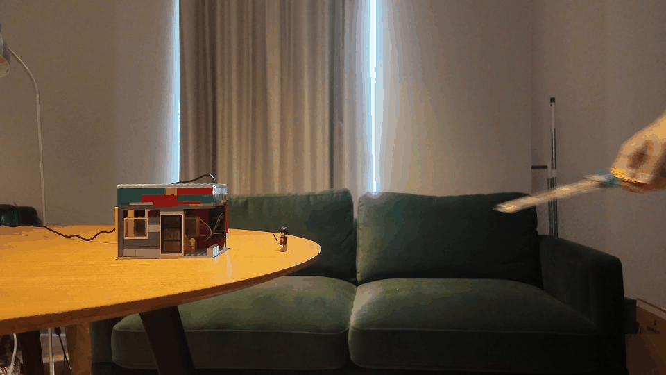
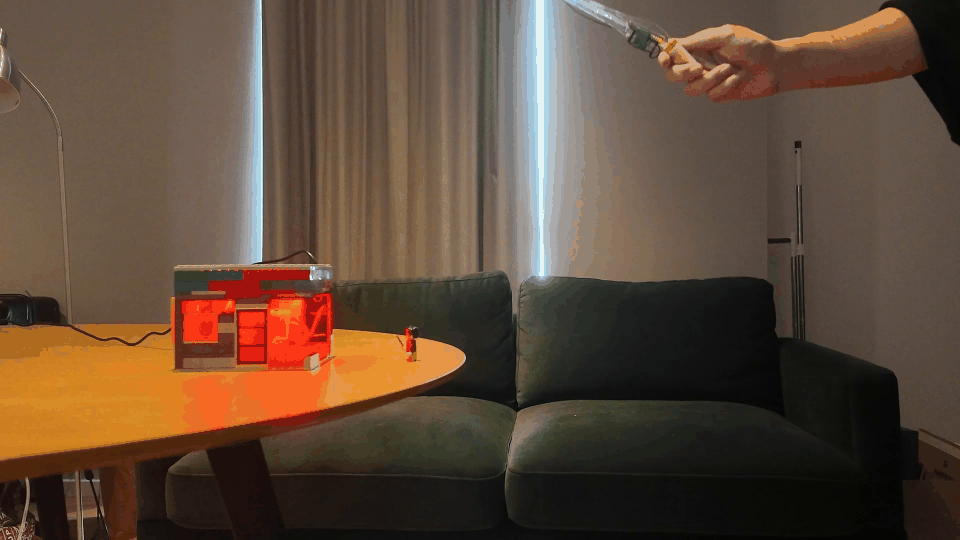
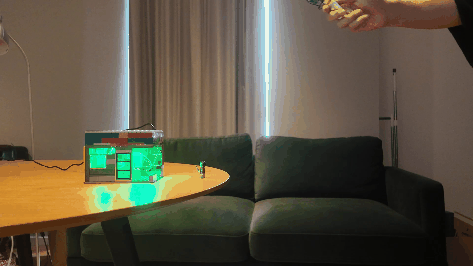

# GlyphWand – TinyML Gesture Recognition Wand
This project uses a simple magic wand to write ‘magic spells’ in the air to control the colour and brightness of the light strips of a smart cabin clock simulated by LEGO.
    
Watch demo video: https://youtu.be/_tfvsXkmZEY

---

## Features & Workflow


Real-time air-gesture recognition on an **Arduino Nano 33 BLE Sense**, transmitting the result over Bluetooth to an **ESP32** that drives an addressable LED strip.


* **Multi‑gesture recognition** – circles, waves, diagonals, and air‑written letters **A, B, C, D**  


* **Ultra‑light 1‑D CNN** (Conv 16×5 → Conv 32×3 → FC 64) quantised to **INT8**  
* **Edge Impulse** end‑to‑end workflow (data → DSP → model → deployment)  
* **Bluetooth LE** messaging to an ESP32; LED strip reacts with configurable light scenes  


---


## Demo
| Wand in action | Image | Raw Data Samples |
|---|---|---|
| "O" |  |||---|---|---|
| "W" |  |||---|---|---|
| "Slope" |  |||---|---|---|
| "Idle" | ---||
---

## Hardware
| Part | Notes |
|------|-------|
| **Arduino Nano 33 BLE Sense Kit** | 9‑axis IMU + nRF52840 BLE SoC |
| **ESP32 (DoIt DevKit V1)** | Receives BLE packets, drives LED strip |
| **WS2812B LED strip** | Any length; tested with 60 pixels |
| Li‑Po battery 3.7 V | ≥ 500 mAh recommended |


---

## Dataset
| Source | Classes | Samples | Rate | Window |
|--------|---------|---------|------|--------|
| **In‑house recordings** | O, W, Slope,  idle | 4 × ≈50 | 100 Hz | 2 s (200 frames) |

Initially, a gesture recognition system was developed using the Arduino Nano 33 BLE Sense. Three basic gestures—circular, wavy, and diagonal—were each performed approximately 50 times, sampled at a frequency of 100 Hz over a duration of 2 seconds, yielding approximately 200 three-axis accelerometer readings per trial while maintaining a fixed handle orientation. A compact model trained on this dataset achieved high accuracy.


The dataset is available for download here: [Glyphwand-export.zip](Dataset/Glyphwand-export.zip)


To expand the dataset, this project incorporated the publicly available IMU Alphabet Dataset from the Indian Institute of Technology and Boston University. This dataset comprises recordings from 124 volunteers, each writing 52 letters 50 times at a sampling frequency of 50 Hz, with sensors placed at varying positions on the pen tip, resulting in approximately 320,000 sequences. From this dataset, approximately 10,000 samples corresponding to the uppercase letters A–D were extracted and reformatted to match the structure of data sets produced independently in the project.

As it is not authorised to be shared here, you can find the original dataset at this link: https://ieee-dataport.org/documents/dataset-inertial-measurement-units-handwritten-english-alphabets-leveraging-diversity

---

## Quick Start
### 1 · Clone & install
```bash
git clone https://github.com/<your-username>/GlyphWand.git
cd GlyphWand
arduino-cli core install arduino:mbed_nano
pio pkg install   # if you prefer PlatformIO
```


### 2 · Flash the TinyML firmware
1. Open **`firmware/glyphwand.ino`** in the Arduino IDE.  
2. Follow the [Edge Impulse deployment guide](https://docs.edgeimpulse.com/docs) to  
   *a)* export the **Arduino library** of the trained model, and  
   *b)* drop the generated ZIP into `firmware/lib/`.  
3. Select *Arduino Nano 33 BLE Sense* and click **Upload**.

### 3 · Simple shell
1. Simple shells cut from dwg files:（You can either laser cut or cut 3mm cardboard）
   Download the shell design file here: [firstcut.dwg](Resources/firstcut.dwg)
2. Installing the Arduino Nano 33 BLE and battery

### 4 · ESP32 & LED 
1. Burning code for the ESP32
2. Wired ESP32 and LED strip
3. Connecting ESP32 and Arduino Nano 33 BLE Sense with Bluetooth

### 5 · Play!
* Wave the wand: the on‑board RGB LED shows the predicted label,  
  the LED strip mirrors it with magical effects ✨  

---


> *Made with ❤️ and a little magic.*
